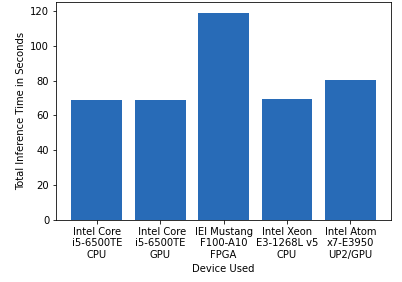

# Computer Pointer Controller

In this project, I have used a gaze detection model to control the mouse pointer of your computer. I have used the Gaze Estimation model to estimate the gaze of the user's eyes and change the mouse pointer position accordingly. This app takes video as input and then app estimates eye-direction and head-pose and based on that estimation it move the mouse pointers.I have used openvino_2020.2.117 installed on windows 10.
I have used my knowledge of how to optimize my model and application code to reduce inference time when running the model at the edge. Using different software optimization techniques to improve the inference time of your model. Calculate how computationally expensive your model is. Use the DL Workbench to optimized my model and benchmarked the performance of my model. Using a VTune amplifier to I am able to find and fix hotspots in your application code. 

## Project Set Up and Installation
Prerequisites:
You need to install openvino successfully.
See this guide for installing openvino.

https://docs.openvinotoolkit.org/latest/_docs_install_guides_installing_openvino_windows.html(It is for windows 10 for other operating systems also you will find the guide in the left side of this page)

Step 1:
Clone this repository

Step 2
To initialize the openVINO environment type this commands in your terminal(This is the default path if you download in openvino for windows 10)

cd C:\Program Files (x86)\IntelSWTools\openvino\bin\
setupvars.bat


Step 3:
Download the following models by using openVINO model downloader:-(the path of the downloader file can change according to your os and installation directory and openvino version)

    1. Face Detection Model: python C:\Program Files (x86)\IntelSWTools\openvino_2020.2.117\deployment_tools\tools\model_downloader --name "face-detection-adas-binary-0001" -o <your_desired_download_path>
    2. Facial Landmarks Detection Model: python C:\Program Files (x86)\IntelSWTools\openvino_2020.2.117\deployment_tools\tools\model_downloader --name "landmarks-regression-retail-0009" -o <your_desired_download_path>
    3. Head Pose Estimation Model: python C:\Program Files (x86)\IntelSWTools\openvino_2020.2.117\deployment_tools\tools\model_downloader --name "head-pose-estimation-adas-0001" -o <your_desired_download_path>
    4. Gaze Estimation Model: python C:\Program Files (x86)\IntelSWTools\openvino_2020.2.117\deployment_tools\tools\model_downloader --name "gaze-estimation-adas-0002" -o <your_desired_download_path>

## Demo

To run the application, open a terminal and go to the project directory:

Run the main.py file using this command:(to run it in cpu)

```
python main.py -f <Path of xml file of face detection model> \
-fl <Path of xml file of facial landmarks detection model> \
-hp <Path of xml file of head pose estimation model> \
-g <Path of xml file of gaze estimation model> \
-i <Path of input video file or enter cam for taking input video from webcam> 
```

- If you want to run app on GPU:-
```
python main.py -f <Path of xml file of face detection model> \
-fl <Path of xml file of facial landmarks detection model> \
-hp <Path of xml file of head pose estimation model> \
-g <Path of xml file of gaze estimation model> \
-i <Path of input video file or enter cam for taking input video from webcam> 
-d GPU
```
- If you want to run app on FPGA:-
```
python main.py -f <Path of xml file of face detection model> \
-fl <Path of xml file of facial landmarks detection model> \
-hp <Path of xml file of head pose estimation model> \
-g <Path of xml file of gaze estimation model> \
-i <Path of input video file or enter cam for taking input video from webcam> 
-d HETERO:FPGA,CPU
```


Similarly if you have FPGA then use:

python main.py -f <Path of xml file of face detection model> \
-fl <Path of xml file of facial landmarks detection model> \
-hp <Path of xml file of head pose estimation model> \
-g <Path of xml file of gaze estimation model> \
-i <Path of input video file or enter cam for taking input video from webcam> 
-d HETERO:FPGA,CPU

If you get Unsupported media format error, then it means that C:\Program Files (x86)\IntelSWTools\openvino_2020.2.117\opencv\bin does not contain opencv_videoio_ffmpeg430_64.dll and some other dll file that we need to run inference on the demo video. Then you will find ffmpeg-download  file(C:\Program Files (x86)\IntelSWTools\openvino_2020.2.117\opencv) in this path. Run this file with powershell and you issue will be resolved


## Documentation

Details about the used pretrained model:

Face Detection Model: https://docs.openvinotoolkit.org/latest/_models_intel_face_detection_adas_binary_0001_description_face_detection_adas_binary_0001.html

Facial Landmarks Detection Model: https://docs.openvinotoolkit.org/latest/_models_intel_landmarks_regression_retail_0009_description_landmarks_regression_retail_0009.html

Head Pose Estimation Model: https://docs.openvinotoolkit.org/latest/_models_intel_head_pose_estimation_adas_0001_description_head_pose_estimation_adas_0001.html

Gaze Estimation Model:https://docs.openvinotoolkit.org/latest/_models_intel_gaze_estimation_adas_0002_description_gaze_estimation_adas_0002.html


Command Line arguments for running the main.py file:

-h (required) : Get the information about all the command line arguments
-fl (required) : Specify the path of Face Detection model's xml file
-hp (required) : Specify the path of Head Pose Estimation model's xml file
-g (required) : Specify the path of Gaze Estimation model's xml file
-i (required) : Specify the path of input video file or enter cam for taking input video from webcam
-d (optional) : Specify the  device to run the video file on the model. Suppoerted devices are: CPU, GPU, FPGA (For running on FPGA used HETERO:FPGA,CPU), MYRIAD.
-l (optional) : Specify the  path of cpu extension if some layers of models are not supported on the device.
-prob (optional) : Specify the probability threshold for face detection model to detect the face.
-flags (optional) : Specify the flags from fd, fld, hp, ge if you want to visualize the output of all models for each frame (write flags with space seperation. Ex:- -flags fd fld hp).


This project folder contains the following files:

face_detection.py:Contains preprocession of video frame, perform infernce on it and detect the face, postprocess the outputs.


facial_landmarks_detection.py:Take the deteted face as input, preprocessed it, perform inference on it and detect the eye landmarks, postprocess the outputs.

head_pose_estimation.py:Take the detected face as input, preprocessed it, perform inference on it and detect the head postion by predicting yaw - roll - pitch angles, postprocess the outputs.

gaze_estimation.py:Take the left eye, rigt eye, head pose angles as inputs, preprocessed it, perform inference and predict the gaze vector, postprocess the outputs.

input_feeder.py:Contains InputFeeder class which initialize VideoCapture as per the user argument and return the rets and frames one by one.

mouse_controller.py:Contains MouseController class which take x, y coordinates value, speed, precisions and according these values it moves the mouse pointer by using pyautogui library.

main.py:The entrypoint of the application which bind all of the system together. user have to run this file to trigger the application

demo.mp4: It is the Input video for the project although you can use webcam also


## Benchmarks
I have added the snapshots of the benchmarking of running this application in different devices on different precision levels.

### FP32

**Inference Time** <br/> 


**Frames per Second** <br/> 


**Model Loading Time** <br/> 


### FP16

**Inference Time** <br/> 


**Frames per Second** <br/> 


**Model Loading Time** <br/> 


### INT8
**Inference Time** <br/> 


**Frames per Second** <br/> 


**Model Loading Time** <br/> 


## Results
I have run the model in 5 diffrent hardware using IntelDevCloud

1.Intel Core i5-6500TE CPU
2.Intel Core i5-6500TE GPU
3.IEI Mustang F100-A10 FPGA
4.Intel Xeon E3-1268L v5 CPU
5.Intel Atom x7-E3950 UP2 GPU

Also benchmarked their  inference time, frame per second and model loading time.

As we can see from attached snapshots that FPGA took more time for inference than other device because it programs each gate of fpga speciific to each computer vision applications
GPU proccesed more frames per second compared to any other hardware and mainly during FP16 because GPU has multiple core and  instruction sets that are specifically optimized to run 16bit floating point operations.

After running models with different precision, we can see that precision affects the accuracy. Mdoel size can reduce by reducing  the precision from FP32 to FP16 or INT8 and inference becomes faster. But as a result of lowering the precision , model can lose some of the important information, that's why accuracy decreases.

### Edge Cases:

In case of multiple faces in the window it will take account of the first detected face and the whole application is dependable on the dace detection model if it can't detect the face it will not work

